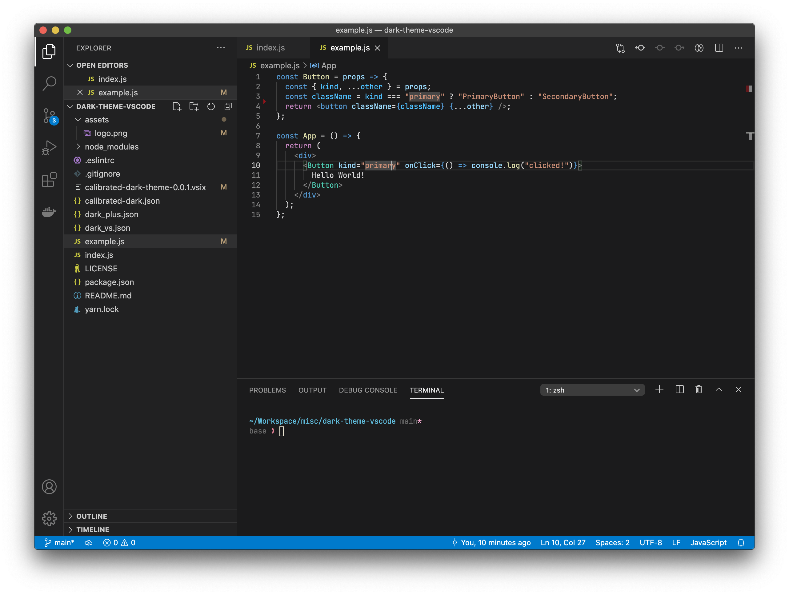

# Calibrated Dark Theme

A calibrated theme based on default dark plus theme, more contrasted.

## Install

```shell
ext install calibrated-dark-theme
```

Then go to `Preferences > Color Theme > Calibrated Dark Theme`.

## Screenshots



## Development

Install dependencies
```shell
yarn
```

Update themes and build VSIX package
```shell
yarn build && yarn package
```
